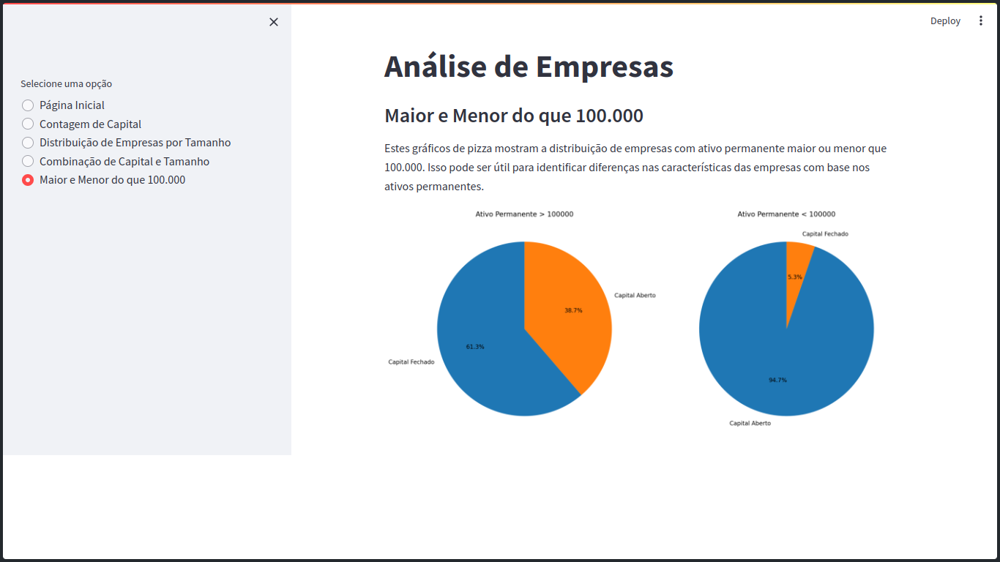

# Projeto de Análise de Dados com Streamlit, Matplotlib, Seaborn e Pandas

### Destaques do Projeto:

#### Integração de Bibliotecas:
- Utilizei Matplotlib, Seaborn e Pandas para criar gráficos detalhados e análises aprofundadas.

#### Interatividade com Streamlit:
- Aproveite a interatividade proporcionada pelo Streamlit para explorar os dados de maneira dinâmica.

### Experiência Visual Aprimorada com Streamlit
-  Demonstração de uma das pages do meu projeto

### Como Executar o Projeto:

#### Instale as dependências listadas no arquivo requirements.txt usando o seguinte comando:
- pip install -r requirements.txt

#### Execute o aplicativo Streamlit:
- streamlit run app.py

##
 ### Contatos:
 - GitHub - https://github.com/nerigleston
 - LinkedIn - https://www.linkedin.com/in/nerigleston/